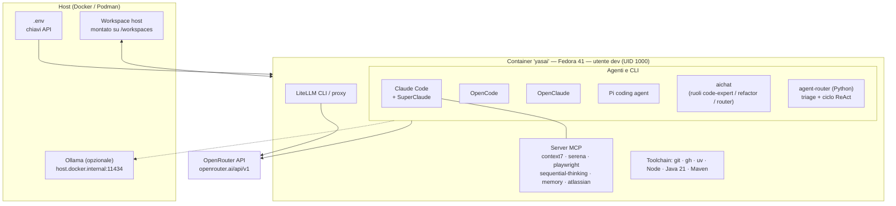
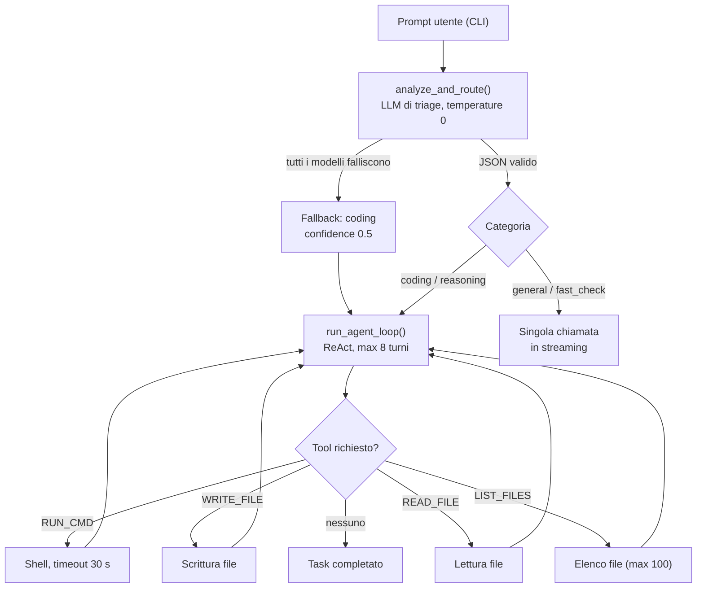

<div align="center">

# 🧪 YASAI
### **Y**et **A**nother **S**andbox **AI**
*Un laboratorio agentico solido e programmabile per lo sviluppo assistito da AI — tutto in un unico container, non-root e ristretto.*

[](https://docs.docker.com/)
[](https://fedoraproject.org/)
[](https://www.python.org/)
[](https://nodejs.org/)
[](https://openjdk.org/)
[](https://maven.apache.org/)
[](https://docs.astral.sh/uv/)

[](https://openrouter.ai/)
[](https://docs.claude.com)
[](https://modelcontextprotocol.io/)
[](https://ollama.com/)
[](https://docs.pydantic.dev/)
[](https://cli.github.com/)

[Cos'è](#-cosè-yasai) • [Cosa c'è dentro](#-cosa-cè-dentro-il-container) • [Architettura](#-architettura) • [Quickstart](#-quickstart) • [Agent router](#-agent-router-python) • [Sicurezza](#-modello-di-sicurezza-stato-attuale) • [Limiti noti](#-limiti-noti-e-roadmap)

---

</div>

## 📌 Cos'è YASAI?

**YASAI** è una **sandbox agentica per lo sviluppo con AI**: un singolo container (Fedora 41, utente non-root `dev`, UID 1000) che raccoglie in un posto solo **più agenti di coding da terminale**, i loro **server MCP**, un **gateway/proxy LLM** e un piccolo **router Python con ciclo ReAct**, tutti configurati per parlare con modelli via **OpenRouter** (o con modelli locali via Ollama).

L'idea: gli agenti possono leggere, scrivere ed eseguire comandi — ma **dentro il container**, con il workspace montato dall'host come unico ponte verso la macchina reale.

> ℹ️ Il livello di isolamento effettivo dipende dalle opzioni di runtime del container. Vedi [Modello di sicurezza (stato attuale)](#-modello-di-sicurezza-stato-attuale) per cosa è applicato oggi e cosa no.

---

## 🧰 Cosa c'è dentro il container

Tutto quanto segue è derivato da [`.devcontainer/Containerfile`](.devcontainer/Containerfile).

### Agenti e CLI AI

| Componente | Ruolo | Come viene installato |
|---|---|---|
| **Claude Code** | Agente di coding da terminale | installer ufficiale `claude.ai/install.sh` (utente `dev`) |
| **SuperClaude** | Framework di comandi/comportamenti sopra Claude Code | `pipx install superclaude` + `superclaude install` |
| **OpenCode** | Agente di coding open source con TUI | `npm i -g opencode-ai@1.18.31` |
| **OpenClaude** | CLI di coding-agent open source per provider cloud e locali (OpenAI-compatibili, Ollama…) | `npm i -g @gitlawb/openclaude@latest` |
| **Pi coding agent** | Harness minimale da terminale (tool base: read/write/edit/bash) | `npm i -g @earendil-works/pi-coding-agent` (prefix `~/.local`) |
| **aichat** | CLI LLM "all-in-one" in Rust, con ruoli pre-configurati | binario `x86_64-unknown-linux-musl` dalle release GitHub |
| **LiteLLM** (`litellm[proxy]`) | Gateway/proxy LLM OpenAI-compatibile | `pip install` (Python di sistema) |
| **backlog.md** | Gestione backlog/task in Markdown | `npm i -g backlog.md@1.52.0` |

### Server MCP pre-registrati

| Server | Registrato tramite |
|---|---|
| `sequential-thinking`, `context7`, `serena`, `playwright` | `superclaude mcp --servers …` |
| `memory` (`@modelcontextprotocol/server-memory`) | `claude mcp add --scope user` |
| `mattpocock-skills` (`@mattpocock/skills`) | `claude mcp add --scope user` |
| `atlassian` (remoto, `https://mcp.atlassian.com/v1/mcp`) | `claude mcp add --transport http` |

### Toolchain di sviluppo

`git` · `gh` (GitHub CLI) · `jq` · `curl` · `python3` + `pip` + `pipx` + `uv` · `nodejs` + `npm` · `java-21-openjdk-devel` + `maven` · `vim-minimal` · `nano` · `openssh-clients` · `fuse3` + `fuse-overlayfs`

### Ruoli e alias `aichat` (pre-configurati)

| Ruolo | Modello | Temperatura | Scopo |
|---|---|---|---|
| `code-expert` | `openrouter:anthropic/claude-3.7-sonnet` | 0.2 | Senior Software Engineer, risposte dirette |
| `refactor` | `openrouter:deepseek/deepseek-r1` | 0.1 | Analisi colli di bottiglia/sicurezza e refactoring |
| `router` | `openrouter:anthropic/claude-3.7-sonnet` | 0.2 | Triage (vedi [limiti noti](#-limiti-noti-e-roadmap)) |

Modello di default di aichat: `openrouter:openai/gpt-4.1`. Alias di shell: `ai-router`, `ai-fast` (Gemini 2.0 Flash), `ai-deep` (DeepSeek R1), `ai-coder`.

### Volumi persistenti

`~/.m2` · `~/.cache/uv` · `~/.local/share/mcp` (memoria MCP) · `~/.claude` (config Claude Code) — più `~/.config/aichat` se usi il Dev Container.

---

## 🏗️ Architettura

### Livelli del laboratorio



### Flusso dell'agent-router



---

## 📋 Struttura del repository

```text
YASAI/
├── .devcontainer/
│   ├── Containerfile         # Immagine: Fedora 41 + agenti + MCP + toolchain
│   └── devcontainer.json     # Ingresso alternativo: VS Code Dev Containers
├── agent-router/
│   ├── config.py             # Chiave/URL OpenRouter, discovery modelli, cataloghi Free/Paid
│   ├── router.py             # Triage della richiesta → categoria + modello
│   ├── schemas.py            # TaskCategory (Enum) e RoutingDecision (Pydantic)
│   ├── agent_engine.py       # Ciclo ReAct, streaming, tool, rollover su 429
│   ├── main_free.py          # Entrypoint CLI — pool di modelli gratuiti
│   ├── main_paid.py          # Entrypoint CLI — catalogo a pagamento
│   ├── main.py               # Versione monolitica precedente (legacy, vedi limiti noti)
│   └── tools.py              # Duplicato dei tool (non importato da nessun modulo)
├── config/
│   ├── config_litellm.yaml   # Alias LiteLLM: fast-model / smart-model (+ fallback)
│   └── instructlab/config.yaml
├── test/
│   ├── test-stack.sh         # Smoke test del container (tool, aichat, LiteLLM, MCP)
│   └── get_free_models.py    # Elenca i modelli gratuiti attivi su OpenRouter
├── docker-compose.yml        # Servizio `yasai-sandbox` (container `yasai`)
└── .env.example              # Template variabili d'ambiente
```

---

## 🚀 Quickstart

**Prerequisiti:** Docker con Compose (o Podman: il file si chiama `Containerfile` e il mount usa il suffisso SELinux `:z`) e una chiave [OpenRouter](https://openrouter.ai/).

```bash
# 1. Clona
git clone https://github.com/axxx75/YASAI.git
cd YASAI

# 2. Variabili d'ambiente
cp .env.example .env
#    → compila almeno OPENROUTER_API_KEY (GITHUB_TOKEN solo se ti serve gh/git via token)

# 3. Adatta il mount del workspace in docker-compose.yml
#    (oggi punta a /home/axxx/yasai:/workspaces:z — sostituiscilo con il tuo path)

# 4. Build e avvio (`entrypoint.sh` avvia Bash come utente `dev`)
docker compose up -d --build

# 5. Entra nel laboratorio
docker compose exec yasai-sandbox bash
```

Dentro il container:

```bash
bash test/test-stack.sh                # verifica binari, aichat, LiteLLM e server MCP
python3 agent-router/main_free.py      # router + agente con modelli gratuiti
python3 agent-router/main_paid.py      # router + agente con modelli a pagamento
aichat -r code-expert "…"              # oppure: claude, opencode, openclaude, pi
```

**Alternativa — Dev Container:** apri la cartella in VS Code con l'estensione Dev Containers; `devcontainer.json` usa lo stesso `Containerfile`, passa `OPENROUTER_API_KEY`, `ANTHROPIC_API_KEY`, `OPENAI_API_KEY` dall'ambiente locale e configura una sessione YASAI locale persistente nel volume `sandbox-yasai-memory`.

> Se il volume della memoria è stato creato prima che
> `/home/dev/.local/share/yasai` fosse predisposta nell'immagine, può essere
> rimasto di proprietà di `root`. Dopo aver fermato il container, elimina
> soltanto il volume `dev-yasai-memory` (Compose) oppure
> `sandbox-yasai-memory` (Dev Container) e ricostruisci. Non eliminare gli
> altri volumi, che possono contenere cache o configurazioni degli agenti.

### Variabili d'ambiente principali (`.env.example`)

| Variabile | Usata da |
|---|---|
| `OPENROUTER_API_KEY` | `agent-router`, aichat, LiteLLM, compose |
| `OPENAI_API_BASE` / `OPENAI_API_KEY` | SDK OpenAI-compatibili, LiteLLM |
| `ANTHROPIC_BASE_URL` / `ANTHROPIC_AUTH_TOKEN` | Claude Code instradato su OpenRouter |
| `CLAUDE_CODE_USE_OPENAI`, `OPENAI_BASE_URL`, `OPENAI_MODEL` | OpenClaude (es. Ollama locale) |
| `OLLAMA_HOST` | Modelli locali via `host.docker.internal:11434` |
| `GITHUB_TOKEN`, `GITHUB_OWNER`, `GITHUB_REPO` | `gh` e integrazioni GitHub |
| `HF_TOKEN`, `ILAB_REMOTE_*` | Hugging Face / InstructLab (configurazione predisposta) |
| `YASAI_MEMORY_DB_PATH` | Percorso del database SQLite delle conversazioni |
| `YASAI_MEMORY_MAX_MESSAGES` | Numero massimo di messaggi conservati per sessione |
| `YASAI_MEMORY_MAX_CONTENT_CHARS` | Dimensione massima di un singolo messaggio salvato |
| `YASAI_MEMORY_OWNER_ID` | Identità obbligatoria del proprietario; isola sessioni con lo stesso ID |
| `YASAI_MEMORY_RETENTION_DAYS` | Giorni di inattività prima della cancellazione automatica |
| `YASAI_SESSION_ID` | Sessione da riprendere all'avvio (default: `default`) |

> ⚠️ `.env` è in `.gitignore`. Non committare mai chiavi reali.

---

## 🧭 Agent router (Python)

Un piccolo motore agentico CLI in [`agent-router/`](agent-router/). Dipende da `requests` e `pydantic`; comunica con OpenRouter (`/chat/completions`, `/models`).

**1. Triage.** Un modello "router" classifica il prompt in `coding`, `reasoning`, `general` o `fast_check` rispondendo solo con JSON (`temperature: 0`, timeout 10 s). Se il primo modello fallisce si scorre la lista di fallback; se falliscono tutti, si ricade su `coding` con `confidence = 0.5`. In caso di successo `confidence` vale un costante `0.9` (non è calcolata dal modello).

**2. Selezione modello.** La categoria mappa su un catalogo:

| Categoria | 💰 Paid | 🆓 Free |
|---|---|---|
| Router (triage) | `openai/gpt-4o-mini` | primo modello free con `flash` / `mini` / `small` nell'id (default `openrouter/free`) |
| `coding` | `anthropic/claude-3.5-sonnet` | keyword `code` / `qwen` / `gemma` |
| `reasoning` | `deepseek/deepseek-r1` | keyword `deepseek` / `nemotron` / `reasoning` |
| `general` | `openai/gpt-4o-mini` | keyword `gemma` / `nemotron` / `glm` |
| `fast_check` | `google/gemini-flash-1.5` | modello del router |
| Catena di fallback | `claude-3.5-sonnet` → `gpt-4o-mini` → `deepseek-chat` | tutti i modelli free rilevati |

Il pool **Free** è scoperto a runtime: si interroga `GET /models` e si tengono i modelli con `pricing.prompt == "0"` e `pricing.completion == "0"` (quindi la dimensione del pool varia nel tempo). Lo stesso elenco si vede con `python3 test/get_free_models.py`.

**3. Esecuzione.** Solo `coding` e `reasoning` entrano nel **ciclo ReAct** (`run_agent_loop`, max **8 turni**, un solo tool per turno). `general` e `fast_check` fanno una singola chiamata in streaming. Su errore **HTTP 429** si passa al modello successivo della lista.

**4. Memoria conversazionale.** Entrambi gli entrypoint salvano in SQLite i
prompt e le risposte finali della sessione. La cronologia recente viene passata
sia al router, per interpretare richieste contestuali, sia al modello scelto. I
messaggi interni dei tool non vengono conservati. Il database applica una
finestra massima configurabile e rimuove i formati di token più comuni prima
del salvataggio. Le sessioni sono separate per proprietario, il file SQLite e
la sua directory usano permessi locali restrittivi e le sessioni inattive
vengono eliminate secondo la retention configurata.

- `/new` crea e seleziona una nuova sessione;
- `/clear` cancella la cronologia della sessione corrente;
- `YASAI_SESSION_ID` permette di selezionare una sessione nota all'avvio;
- il volume `dev-yasai-memory` conserva il database tra le ricreazioni del
  container.

**5. Backlog persistente.** Per lavori complessi o esplicitamente pianificati,
il ciclo ReAct può consultare e aggiornare Backlog.md tramite tool dedicati.
Il backlog non viene usato per domande o correzioni rapide e non viene
inizializzato automaticamente: esegui una volta `backlog init` nella root del
progetto in cui vuoi conservare i task.

**Tool esposti al modello** (sintassi testuale nel system prompt):

| Tool | Sintassi | Comportamento |
|---|---|---|
| `LIST_FILES` | `[LIST_FILES]` | Elenca fino a 100 file, escludendo `.git`, `__pycache__`, `.venv`, `node_modules`, `.pytest_cache`, `dist`, `build` |
| `READ_FILE` | `[READ_FILE: percorso]` | Legge un file UTF-8 |
| `WRITE_FILE` | `[WRITE_FILE: percorso]` + blocco `<<< … >>>` | Crea/sovrascrive un file (crea le directory intermedie) |
| `RUN_CMD` | `[RUN_CMD: comando]` | Esegue in shell, **timeout 30 s**, output troncato a 3000 caratteri |
| `BACKLOG_LIST` | `[BACKLOG_LIST]` | Elenca i task in JSON per evitare duplicati |
| `BACKLOG_VIEW` | `[BACKLOG_VIEW: TASK-ID]` | Legge il dettaglio di un task |
| `BACKLOG_CREATE` | `[BACKLOG_CREATE: titolo]` + blocco `<<< … >>>` | Crea un task persistente con descrizione |
| `BACKLOG_NOTE` | `[BACKLOG_NOTE: TASK-ID]` + blocco `<<< … >>>` | Aggiunge una nota di avanzamento |
| `BACKLOG_COMPLETE` | `[BACKLOG_COMPLETE: TASK-ID]` | Imposta lo stato del task su `Done` |

Esempio di sessione:

```text
=================================================================
  AI LAB - Agentic CLI Engine [MODE: PAID / PRODUCTION]
  Primary Coding Model: anthropic/claude-3.5-sonnet
  Digita 'exit' o 'quit' per uscire.
=================================================================

paid-agent> Crea test pytest per il triage in router.py

[ROUTER PAID]: Categoria -> CODING | Modello Target -> anthropic/claude-3.5-sonnet
--- Turno 1/8 | Modello: [anthropic/claude-3.5-sonnet] ---
[TOOL EXECUTION]: Lettura file 'agent-router/router.py'...
```

### Alias LiteLLM (`config/config_litellm.yaml`)

| Alias | Modello (via OpenRouter) | Fallback |
|---|---|---|
| `fast-model` | `deepseek/deepseek-chat` | — |
| `smart-model` | `anthropic/claude-3.7-sonnet` | `openai/gpt-4o` |

Avvio manuale del proxy: `litellm --config config/config_litellm.yaml` (porta di default 4000).

---

## 🔒 Modello di sicurezza (stato attuale)

Verificato leggendo `docker-compose.yml`, `devcontainer.json` e `Containerfile`.

| Aspetto | Stato | Dettaglio |
|---|---|---|
| Utente non-root | ✅ applicato | `user: "1000:1000"` (utente `dev`) |
| Segreti fuori da Git | ✅ applicato | `.env` e `*.key`/`*.pem` in `.gitignore` |
| Superficie host esposta | ✅ ridotta | un solo mount di workspace (`:z`) + volumi nominati per le cache |
| Timeout sui comandi dell'agente | ✅ applicato | 30 s per `RUN_CMD`, 8 turni massimi |
| Limiti risorse (CPU / RAM / PID) | ❌ **non impostati** | Docker, di default, non applica vincoli di risorse al container |
| Capability ridotte | ❌ **ampliate** | `cap_add: SYS_ADMIN` (di default Docker la esclude), `/dev/fuse` esposto |
| Profilo AppArmor | ❌ **disattivato** | `apparmor:unconfined` |
| Rete | ⚠️ aperta | necessaria per raggiungere OpenRouter e i server MCP |
| Confinamento percorsi dei tool | ⚠️ assente | i tool operano su qualsiasi percorso accessibile all'utente `dev`; l'isolamento è quello del container |
| Segreti visibili all'agente | ⚠️ sì | `OPENROUTER_API_KEY` e `GITHUB_TOKEN` sono variabili d'ambiente del container: `RUN_CMD` può leggerle |

`fuse-overlayfs` e `SYS_ADMIN` fanno pensare a un uso per container annidati/mount FUSE (deduzione, non dichiarata nel repo). Se non ti servono, puoi restringere il container così:

```yaml
# Proposta di hardening — valori d'esempio da tarare, NON ancora nel repo
services:
  yasai-sandbox:
    # rimuovi: devices (/dev/fuse), cap_add: SYS_ADMIN, security_opt: apparmor:unconfined
    cap_drop: [ALL]
    security_opt:
      - no-new-privileges:true
    deploy:
      resources:
        limits:
          cpus: "2.0"
          memory: 4G
          pids: 512
```

Un'opzione ulteriore è passare all'agente solo le chiavi strettamente necessarie (niente `GITHUB_TOKEN` se non serve) o usare un token a scope minimo.

### Riproducibilità della build

Diversi passaggi installano l'ultima versione disponibile (`aichat` da `releases/latest`, `@gitlawb/openclaude@latest`, `pipx install superclaude`, `pip install litellm[proxy]`). OpenCode e Backlog.md sono invece installati a versione fissata. Per un laboratorio "solido" conviene **pinnare anche le altre versioni**. Nota: il 24 marzo 2026 due release PyPI di LiteLLM (1.82.7 e 1.82.8) sono state compromesse; l'avviso ufficiale è nel [blog LiteLLM](https://docs.litellm.ai/blog/security-update-march-2026).

---

## 🧪 Test

| Script | Cosa verifica |
|---|---|
| `test/test-stack.sh` | 5 step: presenza binari (`aichat`, `litellm`, `claude`, `superclaude`, `uv`, `npm`), chiamata `aichat` su OpenRouter, ruoli `code-expert` e `refactor`, `litellm --version`, registrazione dei 7 server MCP |
| `test/get_free_models.py` | Elenca i modelli con prezzo 0 su OpenRouter |

---

## 🧪 Alias comodi:

```text
# SANDBOX LAB-AI
export AI_LAB_DIR="$(pwd)"
export AI_LAB_COMPOSE="$AI_LAB_DIR/docker-compose.yml"

# --- Gestione Lifecycle Container ---
alias lab-up='docker compose -f $AI_LAB_COMPOSE up -d'
alias lab-down='docker compose -f $AI_LAB_COMPOSE down'
alias lab-restart='docker compose -f $AI_LAB_COMPOSE up -d --force-recreate'
alias lab-build='DOCKER_BUILDKIT=1 docker compose -f $AI_LAB_COMPOSE build && docker compose -f $AI_LAB_COMPOSE up -d'
alias lab-rebuild='DOCKER_BUILDKIT=1 docker compose -f $AI_LAB_COMPOSE build --no-cache && docker compose -f $AI_LAB_COMPOSE up -d'

# --- Accesso Shell ---
# Accesso standard come utente 'dev' (workspace predefinito)
alias lab='docker exec -it -w /workspaces yasai /usr/local/bin/entrypoint.sh bash'

# Accesso come 'root' per manutenzione pacchetti (es. apt/dnf)
alias lab-root='docker exec -it -u root -w /workspaces yasai /usr/local/bin/entrypoint.sh bash'

# --- Diagnostic & Monitoraggio ---
alias lab-logs='docker logs -f --tail 100 yasai'
alias lab-status='docker ps --filter "name=yasai"'

```

---


## 🚧 Limiti noti e roadmap

Stato del progetto: sviluppo attivo, prime release (`Start rel 0.1`). Punti aperti individuati:

- [ ] **`agent-router/` non è copiato nell'immagine** (nessun `COPY`/`ADD`): il codice è disponibile perche la cartella è montata su `/workspaces` e contiene questo repository.

- [ ] **`tools.py` è codice orfano**: i tool effettivi sono duplicati in `agent_engine.py` (e in `main.py`).
- [ ] **Nessuna memoria di conversazione** tra un prompt e il successivo: ogni richiesta riparte da zero.
- [x] **Ruolo `router` di aichat**: il prompt vive in `config/prompts/router-system.md`; il `Containerfile` lo copia nell'immagine e lo aggiunge esplicitamente al file del ruolo.

- [ ] **`config_litellm.yaml` e `config/instructlab/config.yaml` non sono agganciati** a compose/Containerfile; InstructLab non è installato nell'immagine.
- [ ] **`.env.example`** definisce due volte `DEFAULT_MODEL` e `OPENAI_API_BASE` (vince l'ultima se il file viene "sourced").
- [ ] **Limiti di risorse e capability** (vedi [sicurezza](#-modello-di-sicurezza-stato-attuale)).
- [ ] **Nessun file `LICENSE`** nel repository: aggiungerne uno e allineare la sezione Licenza.

---

## 📚 Riferimenti

**Container e sicurezza**
- Docker — [Resource constraints](https://docs.docker.com/engine/containers/resource_constraints/)
- Docker — [Compose `deploy` (limits: cpus, memory, pids)](https://docs.docker.com/reference/compose-file/deploy/)
- Docker — [Runtime privilege and Linux capabilities](https://docs.docker.com/engine/containers/run/#runtime-privilege-and-linux-capabilities)
- LiteLLM — [Security update, marzo 2026](https://docs.litellm.ai/blog/security-update-march-2026)

**Strumenti AI**
- [OpenRouter](https://openrouter.ai/) · [LiteLLM docs](https://docs.litellm.ai/) · [aichat](https://github.com/sigoden/aichat)
- [Claude Code / documentazione Claude](https://docs.claude.com) · [Model Context Protocol](https://modelcontextprotocol.io/)
- [SuperClaude Framework](https://github.com/SuperClaude-Org/SuperClaude_Framework) · [OpenCode](https://github.com/anomalyco/opencode) · [OpenClaude](https://github.com/Gitlawb/openclaude) · [Pi coding agent](https://github.com/earendil-works/pi) ([pi.dev](https://pi.dev/))

**Badge e loghi:** [Shields.io](https://shields.io/) con slug [Simple Icons](https://simpleicons.org/).

---

## 🛡️ Licenza

Da definire: al momento nel repository non è presente un file `LICENSE`.
